### 源码地址:

https://gitee.com/RiverBied/XFreeSimple.git

https://github.com/zhoufeihong/XFreeSimple.git

### 基础环境

#### 1、启动mysql、redis基础设施

**如果系统已经安装了Docker Desktop**

在如下图目录右键up.ps1使用Powershell运行或者使用命令行输入"powershell .\up.ps1"运行，即在本机运行了mysql、redis，同时自动创建数据库: "x_free_dev_center_1"。

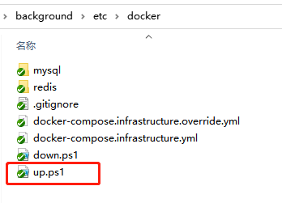

Docker Desktop安装可以参考: https://docs.docker.com/desktop/windows/install/

**已经有Mysql服务、Redis服务**

修改appsettings.json下的配置，确保和环境一致。创建"x_free_dev_center_1"数据库，不然无法启动，数据库名称可以自定义。

```json
"ConnectionStrings": {
    "ApplicationConnection": "Server=127.0.0.1;port=3306;Database=x_free_dev_center_1;User=root; Password=root"
  },
  "Redis": {
    "IsEnabled": true,
    "Configuration": "127.0.0.1:6379,password=123"
  }
```

#### 启动后台服务

**编译解决方案、将XFreeSimpleService.Host设为启动项目**

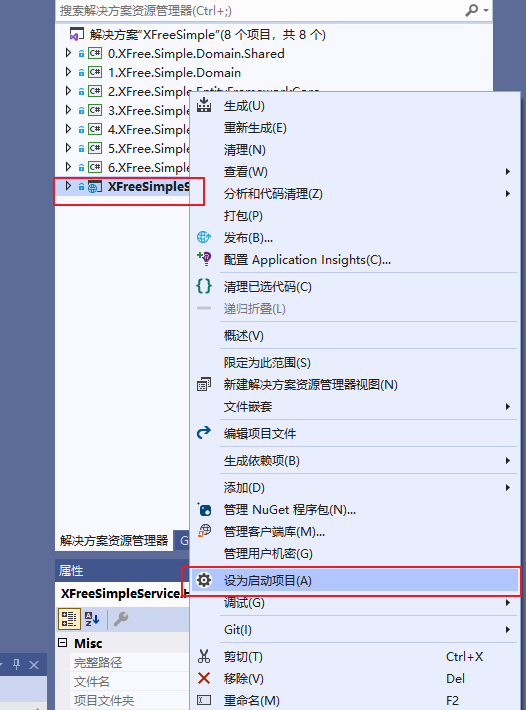

**启动XFree.Simple.Web**


**打开swagger地址**

网址: http://localhost:41130/swagger/index.html。

出现如下界面则说明后台已经正常启动。

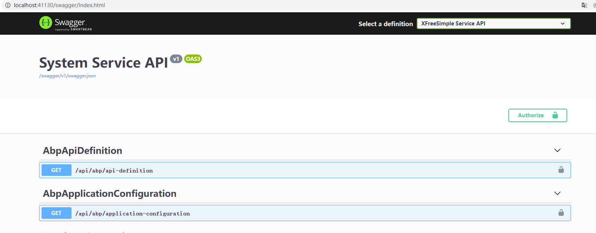

连接数据库，可以看到已经自动初始化数据库表。

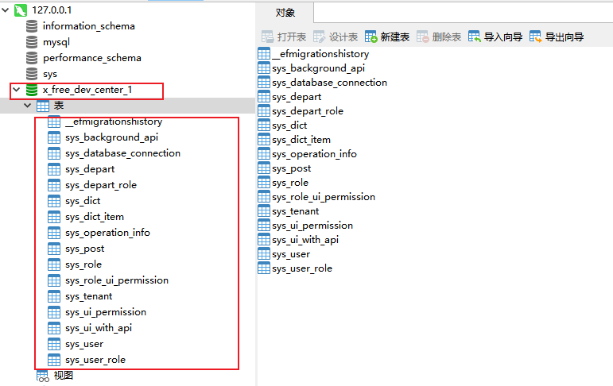

#### 启动前端项目

**使用Visual Code打开项目目录vue-element-admin **

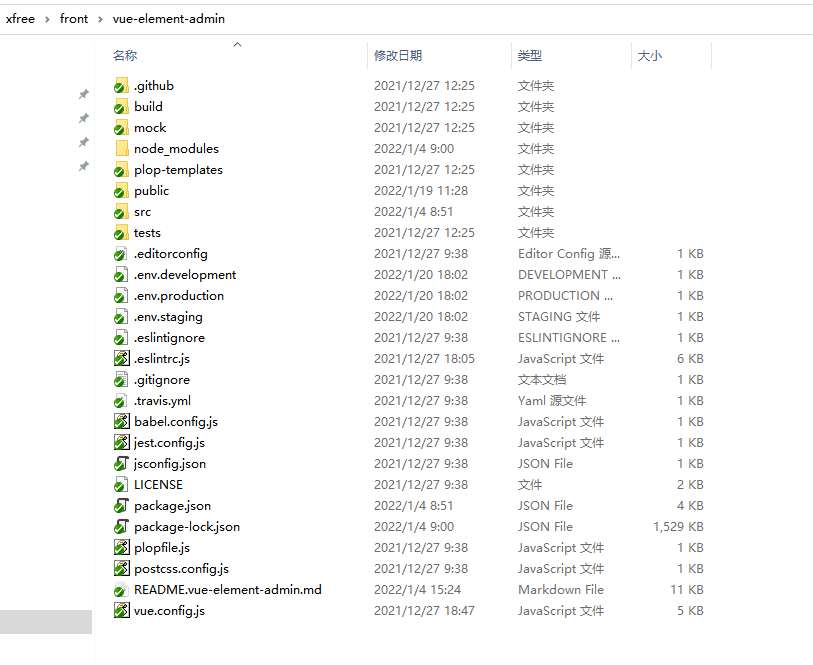

前端基于vue-element-admin方案实现，具体可以参见README.vue-element-admin.md。打开后效果:

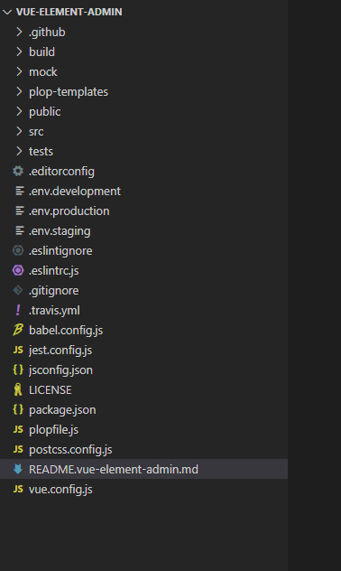

**安装依赖、启动项目 **

```bash
# 安装依赖
npm install

# 建议不要直接使用 cnpm 安装依赖，会有各种诡异的 bug。可以通过如下操作解决 npm 下载速度慢的问题
npm install --registry=https://registry.npm.taobao.org

# 启动服务
npm run dev
```

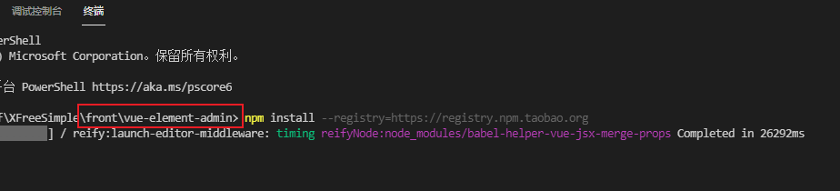

#### 使用功能

#### 平台管理员登录

打开网址: http://localhost:9527/

选择管理后台、输入用户名: admin、输入密码123456，进行登录。

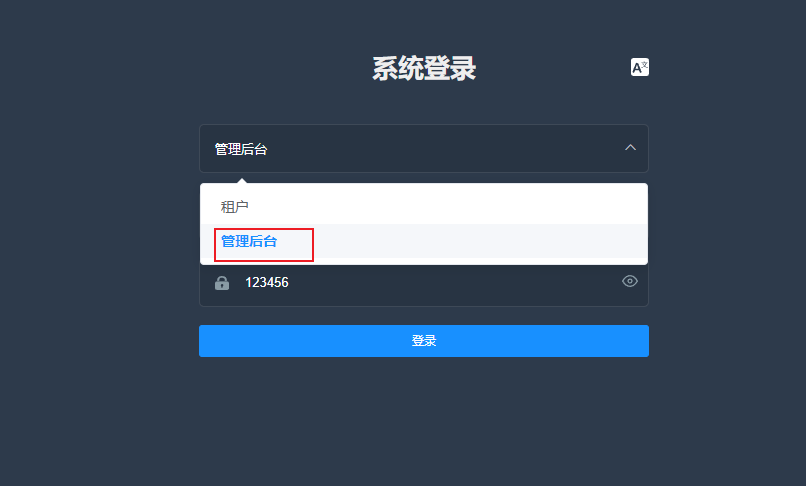

#### 新建数据库连接信息

**供租户使用。支持租户独享、共享数据库。**

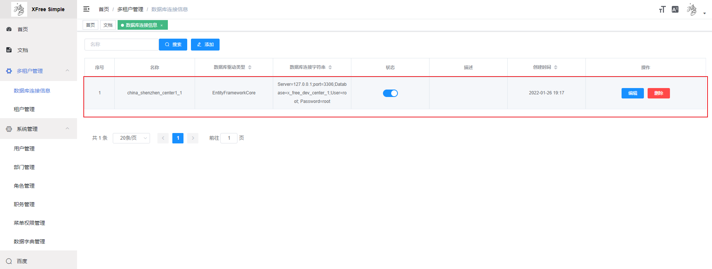

#### 添加租户

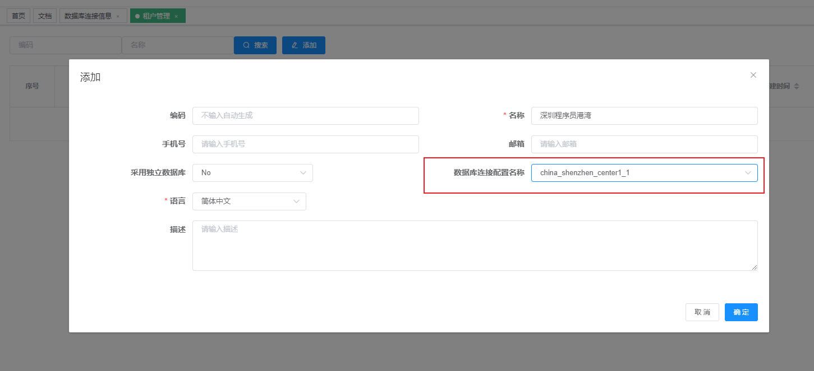

#### 租户登录

登录界面，租户初始密码:123456

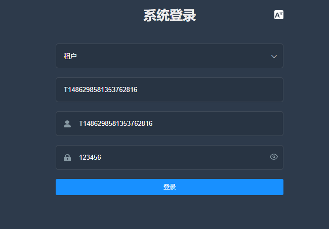
租户管理界面
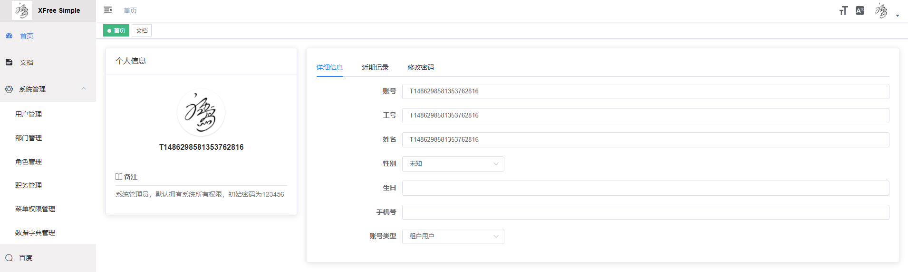
